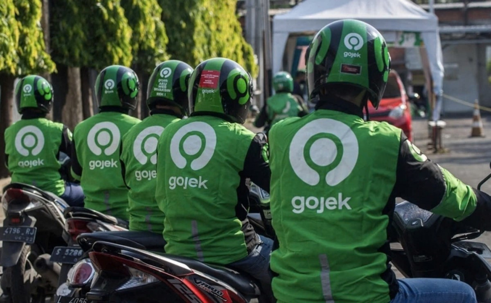
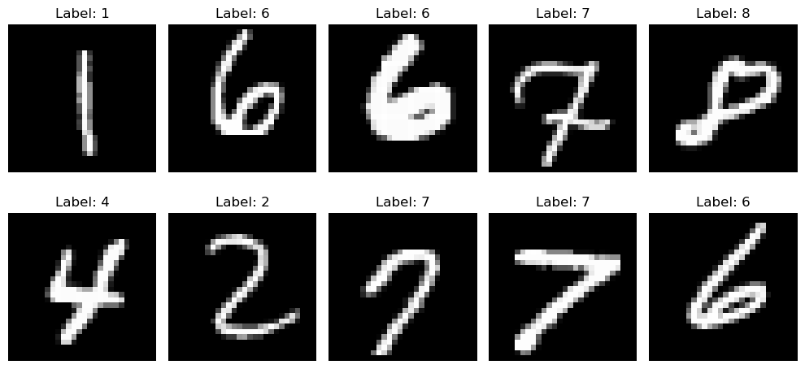

  

# Hi 👋, I'm Muchammad Wildan Alkautsar

#### Data Scientist passionate about transforming data into actionable insights through analytics, machine learning, and data-driven solutions.

- 🔭 I’m currently working on **Asah by Dicoding** Data Science Specialist
- 🌱 I’m currently learning **Artificial Intelligents / Machine Learning Operation Systems**
- 👯 I’m looking to collaborate on **Data Analytics/Machine Learning Engineer**
- 💬 Ask me about **Business problems and I'll found the solutions**
- 📫 How to reach me **muchammadwr@gmail.com**
- 📄 Know about my experiences [Resume](https://docs.google.com/document/d/1f5hSnUd0f0VgddrokSDd3abAM7fpNoZWKEuoNm3YcpY/edit?usp=sharing)
- ⚡ Fun fact **Do first. Perfect later. Learn, iterate, improve.**

<!-- Social Medias -->

## 🔗 Connect with me:

  
  
  
  
  
  

<!-- Languages and Tools -->

## ⚙ Languages and Tools

### IDE

  
  
  

### Languages

  
  
  
  
  

### Libraries

  
  
  
  
  

### Databases

  
  
  

### Frameworks

  
  
  

### Others

  
  
  
  
  
  
  
  
  
  
  
  
  
  
  
  
  
  
  

<!-- Projects -->

## 🛠 Projects

<table>
<tr>

<!-- Bike Sharing -->
<td width="33%">

**Bike Sharing Demand Analytics**

Analyzing bike rental patterns and customer behavior.

**[Show More →](https://github.com/muchammadwr/Bike-Sharing-Analytics)**

</td>

<!-- Finance Analytics -->
<td width="33%">

**Finance Analytics**

Analyzing financial performance and profitability.

**[Show More →](https://github.com/muchammadwr/finance-analytics)**

</td>

<!-- Starbucks Sales -->
<td width="33%">

**Analyzing the Indonesian Supermarket Business**

Discovering customer behavior and purchasing patterns.

**[Show More →](https://github.com/muchammadwr/analyzing-the-indonesian-supermarket-business)**

</td>
</tr>

<tr>
<!-- Sentiment Analytics -->
<td width="33%">

**Gojek Sentiment Analytic Reviews**

Analyzing sentiment from textual data.

**[Show More →](https://github.com/muchammadwr/sentiment_analytics)**

</td>

<!-- Image Classifications -->
<td width="33%">

**MNIST Image Classifications**

Classifying handwritten digits using machine learning.

**[Show More →](https://github.com/muchammadwr/image_classifications)**

</td>

<!-- HR Analytics -->
<td width="33%">

**Human Resources Case Studies**

Analyzing employee data for insights.

**[Show More →](https://github.com/muchammadwr/Menyelesaikan-Permasalahan-Human-Resources)**

</td>
</tr>

</table>

## 📊 GitHub Stats:

 
 

## 🎯 Play games with me

<!-- Arcade Games -->

<picture data-importer="pacman">
  <source media="(prefers-color-scheme: dark)" srcset="https://raw.githubusercontent.com/muchammadwr/muchammadwr/pacman-output/pacman-contribution-graph-dark.svg?game=pacman">
  <source media="(prefers-color-scheme: light)" srcset="https://raw.githubusercontent.com/muchammadwr/muchammadwr/pacman-output/pacman-contribution-graph.svg?game=pacman">
  
</picture>

## ✍️ Random Dev Quote

